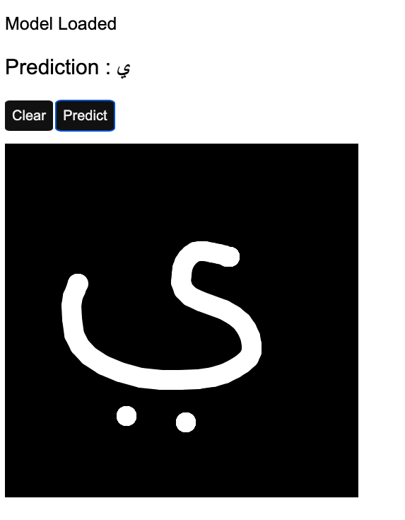

# Arabic Alphabet Drawing Recognition

## With Accuracy : ~98% 
## Model Training Code : [here](https://github.com/Shubbair/deep-learning/tree/main/Arabic%20Alphabet%20Classification)

the dataset contains 16800 of handwritten Arabic characters, you can see it [here](https://www.kaggle.com/datasets/mloey1/ahcd1)

to Reach the experiment [here](https://shubbair.github.io/Arabic-HandWriting-Recognition/)

